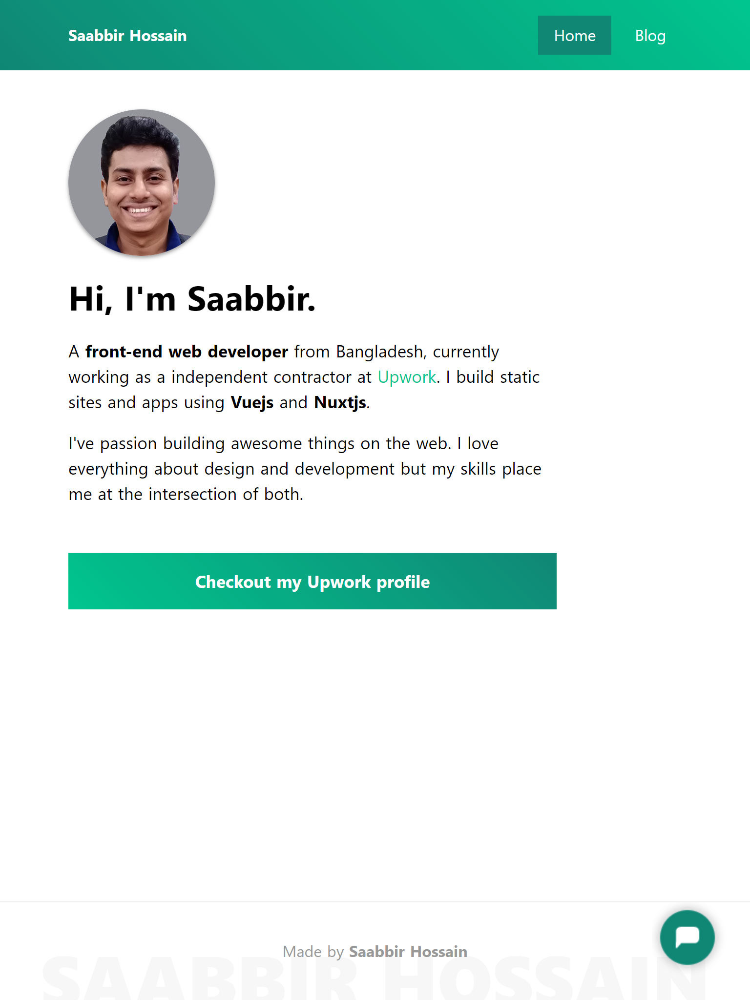

# My personal website using nuxtjs



Demo can be seen in here - https://saabbir.github.io/

## Getting started

Clone this repo:

`git clone https://github.com/Saabbir/saabbir.github.io.git`

The project is based on [Node.js](https://nodejs.org/). To install the necessary packages, run the following command from the root of the project:

`npm install`

### After installation

- Run `npm run dev` from root folder to serve with hot reload at localhost:3000

### Build setup

```bash
# build for production and launch server
$ npm run build
$ npm run start

# generate static project
$ npm run generate

# preview generated static site
$ npm run start

# deploy from command line
$ npm run deploy
```

For detailed explanation on how things work, check out [Nuxt.js docs](https://nuxtjs.org).