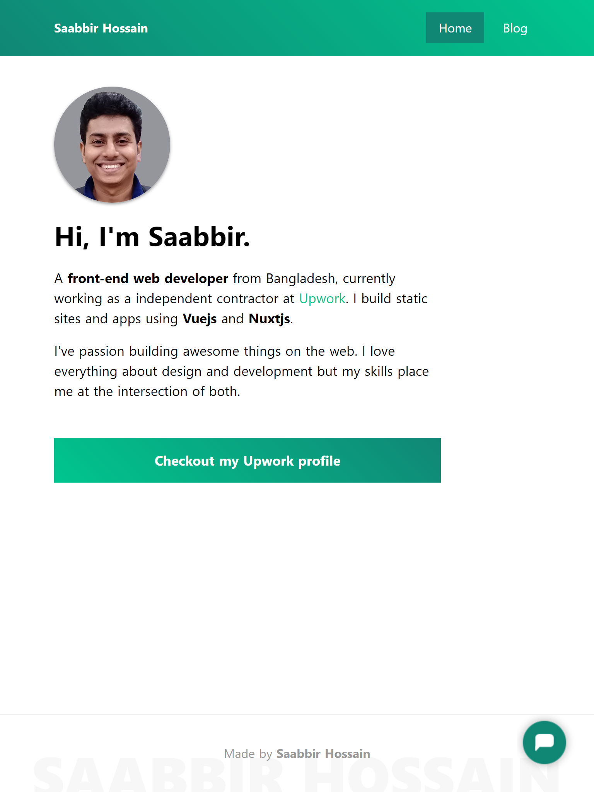

# Saabbir's Personal Website (Nuxt 3)



Live demo: [https://saabbir.github.io/](https://saabbir.github.io/)

---

## Prerequisites

- **Node.js:** v18 or later (v20 LTS recommended)
- **npm:** v9 or later

```sh
node -v   # should be 18+
npm -v
```

---

## Getting Started

1. **Clone the repository:**
   ```sh
   git clone https://github.com/Saabbir/saabbir.github.io.git
   cd saabbir.github.io
   ```

2. **Install dependencies:**
   ```sh
   npm install
   ```

3. **Run the development server:**
   ```sh
   npm run dev
   ```
   The site will be available at [http://localhost:3000](http://localhost:3000)

---

## Build & Deployment

- **Generate static site** (for GitHub Pages):
  ```sh
  npm run generate
  ```
  This copies `assets/images` to `public/images` and outputs the site to `.output/public`.

- **Preview the generated site:**
  ```sh
  npm run preview
  ```

- **Deploy to GitHub Pages:**
  ```sh
  npm run deploy
  ```
  Builds the static site and pushes `.output/public` to the `gh-pages` branch.

---

## Troubleshooting

- **Dependency or build errors?**  
  Delete `node_modules` and `package-lock.json`, then run `npm install` again.

- **Images missing on generated site?**  
  Run `npm run copy:assets` once to copy `assets/images` into `public/images`, or run `npm run generate` (it runs the copy step automatically).

---

## References

- [Nuxt 3 Documentation](https://nuxt.com/docs)
- [Nuxt Content v2](https://content.nuxt.com/)
- [PROJECT_GUIDE.md](PROJECT_GUIDE.md) – project structure and content workflow
