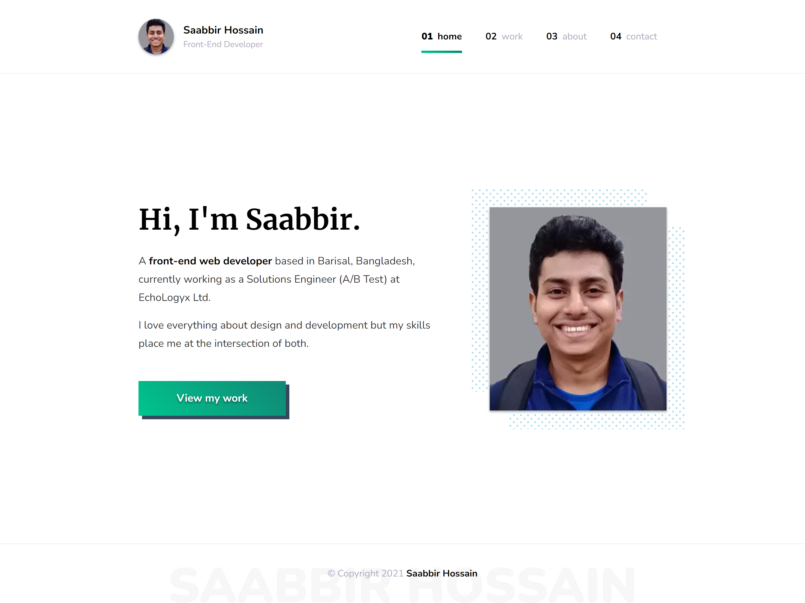

# Saabbir's Personal Website (Nuxt.js v2)



Live demo: [https://saabbir.github.io/](https://saabbir.github.io/)

---

## ⚠️ Prerequisites & Compatibility

This project was built with **Node.js v14** and **npm v6**. It is **not compatible with Node.js 16+ or npm 7+** due to legacy dependencies and Nuxt 2 limitations.

**If you use a newer Node.js version, you will encounter errors.**

### Required Versions

- **Node.js:** `^14.21.1`  
- **npm:** `^6.14.17`

You can check your versions with:

```sh
node -v
npm -v
```

If you have a newer version installed, use [nvm](https://github.com/nvm-sh/nvm) (Node Version Manager) to install and switch to the correct versions:

```sh
# Install nvm if you don't have it
curl -o- https://raw.githubusercontent.com/nvm-sh/nvm/v0.39.7/install.sh | bash
# Restart your terminal, then:
nvm install 14.21.1
nvm use 14.21.1
npm install -g npm@6.14.17
```

---

## 🚀 Getting Started

1. **Clone the repository:**
	 ```sh
	 git clone https://github.com/Saabbir/saabbir.github.io.git
	 cd saabbir.github.io
	 ```

2. **Install dependencies:**
	 ```sh
	 npm install
	 ```
	 > If you see errors, double-check your Node.js and npm versions.

3. **Run the development server:**
	 ```sh
	 npm run dev
	 ```
	 The site will be available at [http://localhost:3000](http://localhost:3000)

---

## 🛠️ Build & Deployment

- **Build for production:**
	```sh
	npm run build
	```
- **Generate static site:**
	```sh
	npm run generate
	```
- **Preview generated static site:**
	```sh
	npm run start
	```
- **Deploy to GitHub Pages:**
	```sh
	npm run deploy
	```
	> This will push the `dist` folder to the `gh-pages` branch.

---

## 🧑‍💻 Troubleshooting

- **Dependency or build errors?**
	- Ensure you are using Node.js 14 and npm 6 (see above).
	- Delete `node_modules` and `package-lock.json`, then reinstall:
		```sh
		rm -rf node_modules package-lock.json
		npm install
		```
- **Still having issues?**
	- Check for OS-specific issues (some dependencies may require build tools).
	- Search for the error message online or check the [Nuxt 2 docs](https://nuxtjs.org/docs/2.x/get-started/installation).

---

## 📚 References

- [Nuxt.js 2 Documentation](https://nuxtjs.org/docs/2.x/get-started/installation)
- [Create a Blog with Nuxt Content](https://nuxtjs.org/blog/creating-blog-with-nuxt-content)

---

## 📝 Notes

- This project uses legacy dependencies and is not actively maintained for newer Node.js versions.
- For a modern Nuxt project, consider upgrading to [Nuxt 3](https://nuxt.com/).
